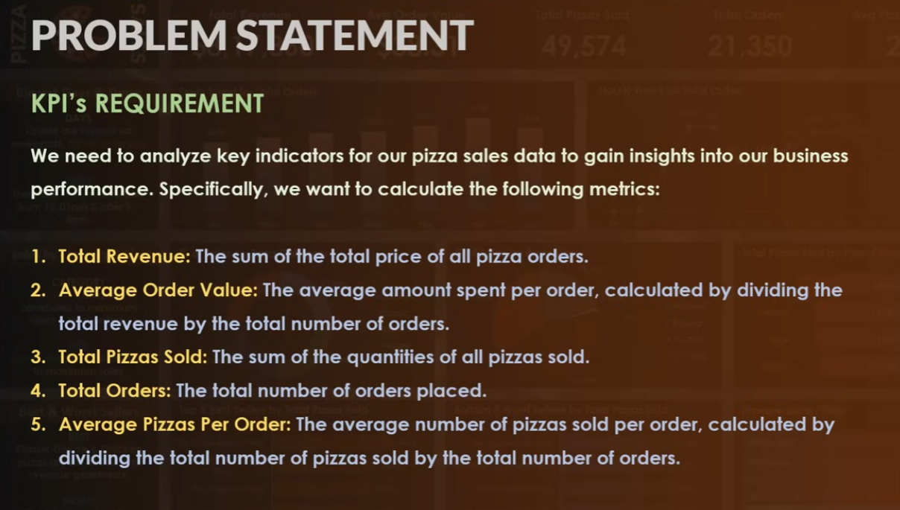
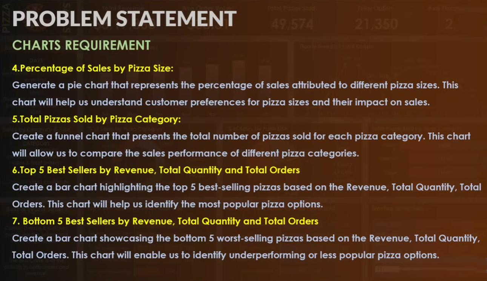
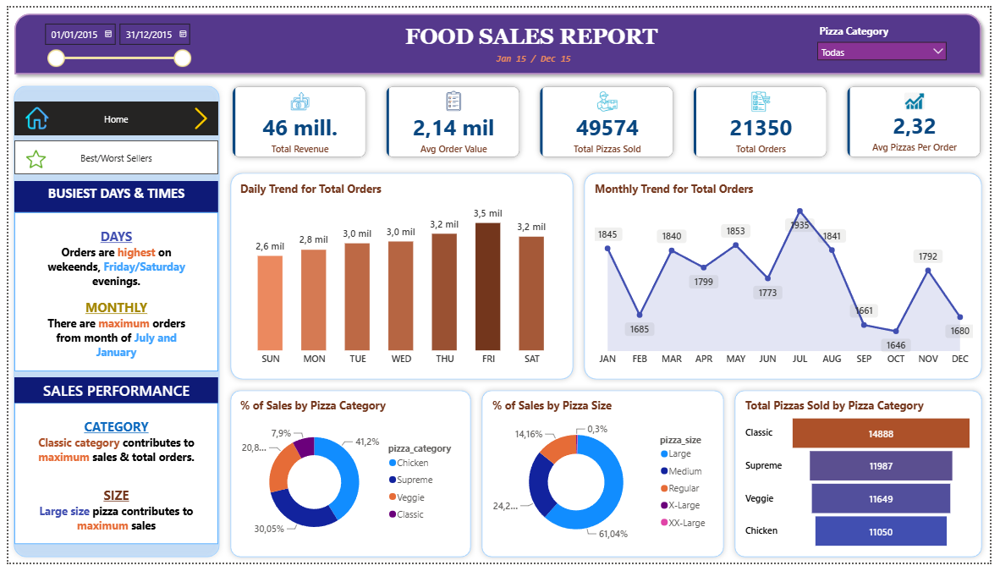
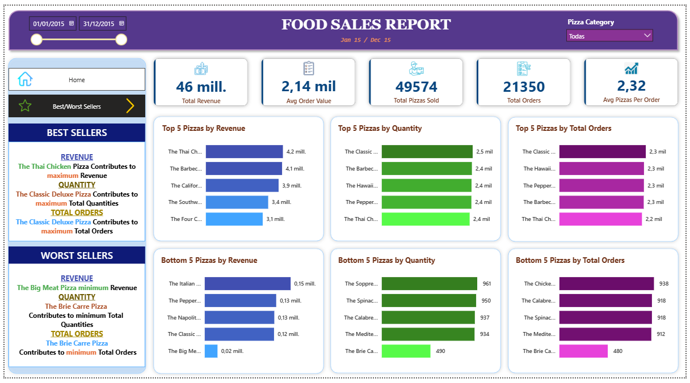
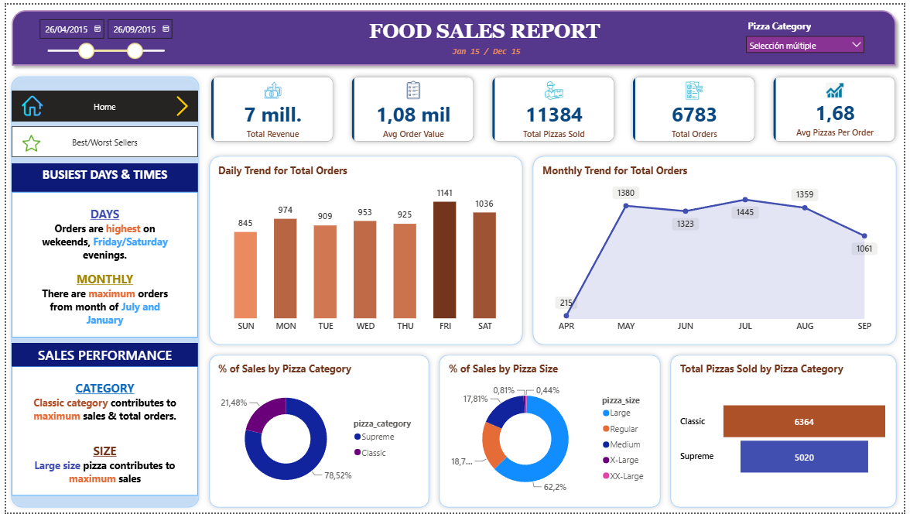
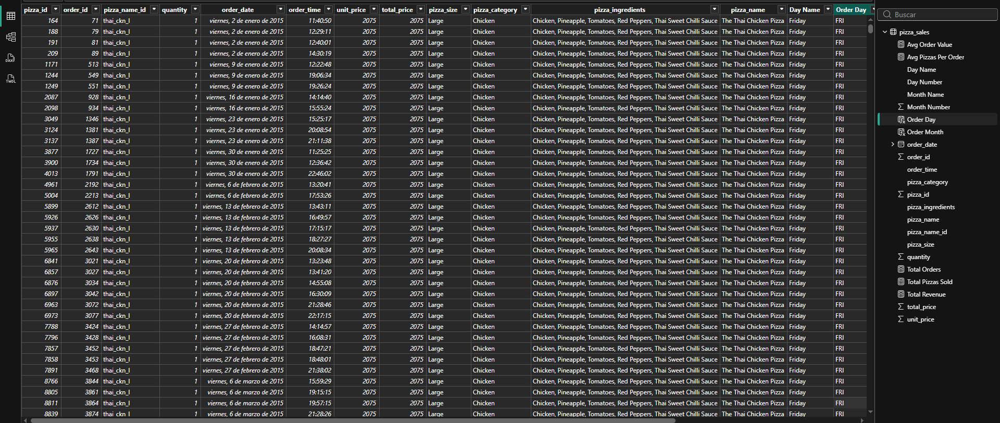

# Proyecto Power BI - Análisis de Ventas

Repositorio orientado al desarrollo de un dashboard interactivo en Power BI para el análisis de un conjunto de datos de ventas.

El proyecto incluye las etapas de limpieza, transformación, modelado y visualización de datos mediante Power Query y DAX, con el objetivo de responder a distintos requerimientos de negocio a través de indicadores clave (KPIs) y visualizaciones interactivas.

---

## Objetivos del proyecto

- Analizar el desempeño de las ventas mediante indicadores clave (KPIs)
- Identificar tendencias y patrones de comportamiento
- Comparar el rendimiento de categorías y productos
- Obtener información útil para la toma de decisiones
- Desarrollar un dashboard interactivo para el análisis de datos comerciales

---

## Tecnologías utilizadas

- Power BI Desktop
- Power Query
- DAX

---

## Proceso desarrollado

Durante el proyecto se realizaron las siguientes etapas:

- Limpieza y transformación de datos mediante Power Query
- Creación de columnas auxiliares para el análisis temporal
- Desarrollo de medidas DAX para el cálculo de KPIs
- Diseño e implementación de un dashboard interactivo
- Desarrollo de visualizaciones para el análisis de tendencias, categorías y productos
- Implementación de segmentadores, filtros y navegación entre páginas

---

## KPIs implementados

El dashboard incorpora indicadores clave para el seguimiento del desempeño de las ventas, entre ellos:

- Total Revenue
- Average Order Value
- Total Pizzas Sold
- Total Orders
- Average Pizzas per Order

---

## Visualizaciones implementadas

El dashboard incluye distintas visualizaciones orientadas al análisis de la información, entre ellas:

- Tendencia diaria de pedidos
- Tendencia mensual de pedidos
- Porcentaje de ventas por categoría
- Porcentaje de ventas por tamaño
- Top 5 productos por ingresos, cantidad vendida y pedidos

---

## Requerimientos del proyecto

El dashboard fue desarrollado para responder a una serie de requerimientos de negocio previamente definidos, contemplando tanto el cálculo de indicadores clave (KPIs) como la creación de visualizaciones para el análisis de las ventas.

### KPIs requeridos

### Visualizaciones requeridas

---

## Dashboard

### Vista general

### Resumen del análisis

### Interactividad

La información puede explorarse dinámicamente mediante segmentadores por categoría y rango de fechas, actualizando automáticamente todos los indicadores y visualizaciones.

### Tabla y Datos

